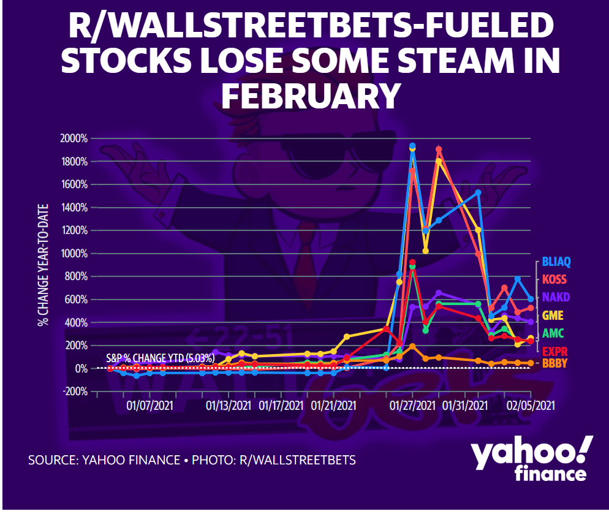
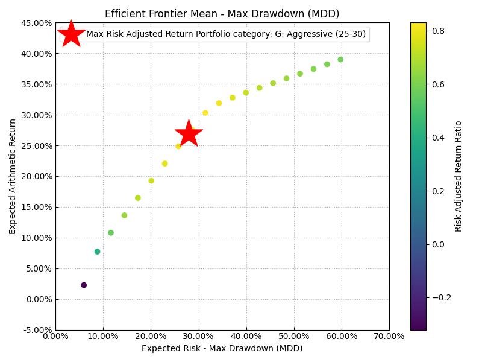
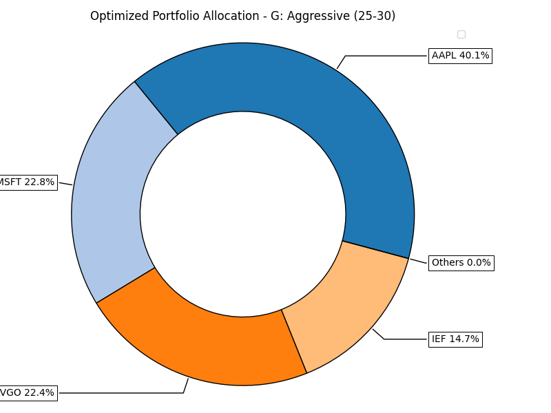
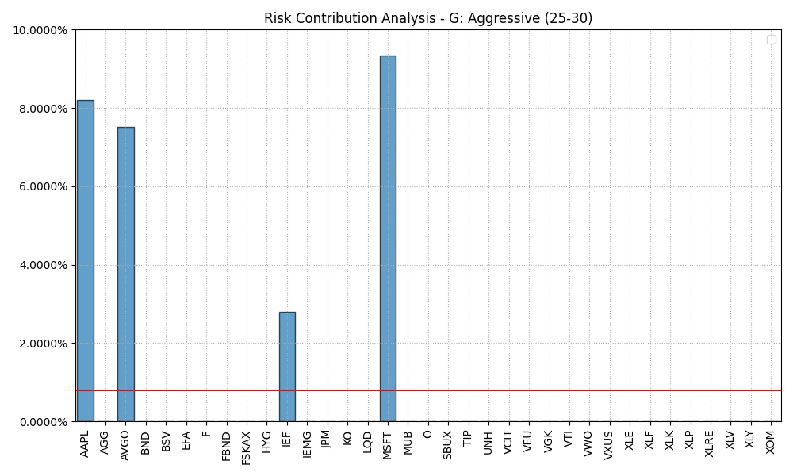
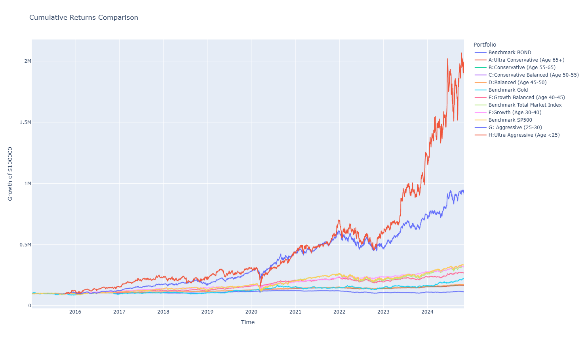

# Enhancing Risk Management in Large Blend Portfolios Using Fixed ETFs

# Shruti Khetan

# Agenda Items

Context and Problem Statement

Objective of the Project

Methodology and Findings

Argument Against Speculative Investing

# Context and Problem Statement

# Internet-driven volatility

* __Impact of Online Trading__
  * The emergence of online trading platforms has significantly changed market dynamics\, allowing quick reactions to news\.
* __Increased Market Volatility__
  * Retail investors' rapid responses to market trends contribute to higher volatility and erratic price movements\.
* __Speculative Bubbles__
  * Quick trading decisions can lead to speculative bubbles as investors chase trends without solid fundamentals\.

# Meme-based investments

* __Impact of Social Media__
  * Social media platforms play a crucial role in driving meme\-based investments\, creating hype that influences stock prices\.
* __Market Volatility__
  * Meme\-driven investments contribute to increased market volatility\, leading to rapid price fluctuations and speculation\.
* __Speculative Risks__
  * Investors face heightened risks of speculative losses when investing in stocks driven by memes rather than solid fundamentals\.

# Stock upticks driven by latest news

* __A new CEO takeover__
  * Starbucks\, Chipotle\, Intel: People dumped/put call options\, leading to an unpredictable trading environment for investors\.
  * __Trump Doner Stocks__
  * People started pouring into company stocks who donated for President Trump campaign; profiting short term by upticks until the market corrects itself in near future\.
  * __/r/__  __wallstreetbets__
  * People from a popular subreddit manipulated the market\, essentially following the herd mentality often bought into overhyped stocks too late\, causing them to purchase at inflated prices\. When the prices crashed\, they were left with significant losses as they had no risk management or exit strategies\.

# Objective of the Project

# Age-based portfolio optimization

# Methodology and Findings

| __Portfolio__ | __Top 5 Stock Split__ | __Risk Measure__ | __Return \(%\)__ | __Risk \(%\)__ | __Sharpe__ | __alpha__ | __beta__ | __Max Drawdown \(%\)__ |
| :-: | :-: | :-: | :-: | :-: | :-: | :-: | :-: | :-: |
| Benchmark BOND | \{'BND': 0\.92\, 'AGG': 0\.08\} | MSV | 1\.592001906 | 5\.4161 | \-0\.478 | 4\.55E\-05 | 0\.0326 | \-18\.56701171 |
| Ultra Conservative \(Age 65\+\) | \{'BSV': 0\.76\, 'MUB': 0\.08\, 'UNH': 0\.04\, 'AVGO': 0\.03\, 'JPM': 0\.03\} | MAD | 5\.708703384 | 4\.0751 | 0\.3751 | 0\.000117823 | 0\.185 | \-9\.639295723 |
| Conservative \(Age 55\-65\) | \{'BSV': 0\.84\, 'AVGO': 0\.05\, 'MSFT': 0\.04\, 'UNH': 0\.04\, 'AAPL': 0\.02\} | MSV | 6\.011171981 | 4\.1826 | 0\.4378 | 0\.000128451 | 0\.1874 | \-9\.458768911 |
| Conservative Balanced \(Age 50\-55\) | \{'BSV': 0\.84\, 'AVGO': 0\.06\, 'UNH': 0\.05\, 'AAPL': 0\.02\, 'MSFT': 0\.02\} | CVaR | 6\.164919644 | 4\.3054 | 0\.461 | 0\.000132962 | 0\.1901 | \-9\.154751459 |
| Balanced \(Age 45\-50\) | \{'BSV': 0\.83\, 'AVGO': 0\.05\, 'MSFT': 0\.04\, 'UNH': 0\.04\, 'AAPL': 0\.02\} | MV | 6\.174464194 | 4\.293 | 0\.4646 | 0\.000129946 | 0\.1959 | \-9\.595313433 |
| Benchmark Gold | \{'GLD': 1\.0\} | MSV | 9\.12162427 | 14\.049 | 0\.3517 | 0\.000342183 | 0\.0364 | \-22\.00216813 |
| Growth Balanced \(Age 40\-45\) | \{'IEF': 0\.67\, 'AAPL': 0\.21\, 'AVGO': 0\.12\} | RG | 11\.34303465 | 9\.9154 | 0\.7224 | 0\.00022327 | 0\.3861 | \-20\.0333789 |
| Benchmark Total Market Index | \{'VTI': 1\.0\} | MSV | 13\.2981961 | 18\.046 | 0\.5053 | 0\.00E\+00 | 1\.0164 | \-35\.0002831 |
| Growth \(Age 30\-40\) | \{'BSV': 0\.54\, 'UNH': 0\.24\, 'AVGO': 0\.15\, 'XOM': 0\.05\, 'MSFT': 0\.02\} | CDaR | __13\.32986247__ | __10\.529__ | 0\.869 | 0\.00024867 | 0\.4771 | \-18\.70391079 |
| Benchmark SP500 | \{'SPY': 1\.0\} | MSV | __13\.6832527__ | __17\.682__ | 0\.5374 | 0\.00E\+00 | 1 | \-33\.71727185 |
| Aggressive \(Age 25\-30\) | \{'AAPL': 0\.4\, 'MSFT': 0\.23\, 'AVGO': 0\.22\, 'IEF': 0\.15\} | MDD | 26\.87732295 | 22\.281 | 1\.0187 | 0\.000440368 | 1\.0658 | \-26\.84336989 |
| Ultra Aggressive \(Age <25\) | \{'AVGO': 1\.0\} | MDD | 38\.98563339 | 36\.028 | 0\.9661 | 0\.000741437 | 1\.3712 | \-48\.29997196 |

# Risk measures applied

* __Riskfolio__  __ Lib Optimizer__
  * Using the appropriate risk measure and objective function to get the optimal weights for the portfolio
* __Beta Coefficient__
  * Beta measures the volatility or risk of an asset in relation to the overall market\, indicating its systematic risk\.
* __Value at Risk \(__  __VaR__  __\)__
  * Value at Risk \(VaR\) estimates the maximum potential loss over a specified time period with a given confidence level\.

# Portfolio Categorization by Age Groups

| __Portfolio__ | __Return \(%\)__ | __Risk \(%\)__ | __Sharpe__ | __alpha__ | __beta__ | __Max % Drawdown__ |
| :-: | :-: | :-: | :-: | :-: | :-: | :-: |
| Age 65\+ | 5\.70870 | 4\.07511 | 0\.37513 | 0\.00012 | 0\.18504 | \-9\.63930 |
| Age 55\-65 | 6\.01117 | 4\.18260 | 0\.43781 | 0\.00013 | 0\.18738 | \-9\.45877 |
| Age 50\-55 | 6\.16492 | 4\.30541 | 0\.46103 | 0\.00013 | 0\.19008 | \-9\.15475 |
| Age 45\-50 | 6\.17446 | 4\.29304 | 0\.46458 | 0\.00013 | 0\.19586 | \-9\.59531 |
| Age 40\-45 | 11\.34303 | 9\.91541 | 0\.72241 | 0\.00022 | 0\.38612 | \-20\.03338 |
| Age 30\-40 | 13\.32986 | 10\.52902 | 0\.86901 | 0\.00025 | 0\.47708 | \-18\.70391 |
| Age 25\-30 | 26\.87732 | 22\.28065 | 1\.01870 | 0\.00044 | 1\.06582 | \-26\.84337 |
| Age <25 | 38\.98563 | 36\.02772 | 0\.96608 | 0\.00074 | 1\.37121 | \-48\.29997 |

* __Investment Strategies Overview__
  * Understanding how investment strategies evolve is crucial as investors move through various life stages\.
* __Importance of Age Grouping__
  * Categorizing portfolios by age allows for tailored investment approaches that align with risk tolerance and goals\.
* __Life Stage Considerations__
  * Different life stages require distinct investment strategies to optimize financial growth and security\.

# Performance comparison with benchmark

* __Diversified Portfolios__
  * Our recommended diversified portfolios are designed to mitigate risk while providing stable returns over time\.
* __Market Benchmarks__
  * We compared our portfolios against market benchmarks to evaluate their performance in different market conditions\.
* __Risk Mitigation__
  * The analysis emphasizes how our strategies effectively mitigate risks compared to traditional investment options\.

# Argument Against Speculative Investing

# Predictability of Portfolio Models

* __Diversified Portfolios__
  * Diversified portfolios include various asset classes that reduce risk and enhance stability over time\.
* __Predictable Models__
  * Predictable portfolio models utilize historical data and trends to inform investment decisions and forecasting\.
* __Stable Returns__
  * Utilizing these models can lead to more stable and reliable returns compared to speculative investments\.

<!--  -->

# Benefits of Diversification

* __Risk Reduction__
  * Diversification significantly reduces risk by distributing investments across various asset classes and sectors\.
* __Stable Returns__
  * A well\-diversified portfolio helps achieve more stable returns over time\, countering significant market fluctuations\.
* __Protection Against Downturns__
  * Diversification provides a safety net during market downturns\, ensuring that losses in one area can be balanced by gains in another\.

# Evidence-based investment decisions

* __Informed Investment Choices__
  * Investors who utilize research and data are better positioned to make informed choices\, reducing risks associated with speculation\.
* __Long\-term Outcomes__
  * Data\-driven investment strategies lead to better long\-term outcomes\, enhancing the potential for financial growth\.
* __Research Over Speculation__
  * Focusing on research rather than speculation allows investors to navigate markets more effectively and confidently\.
